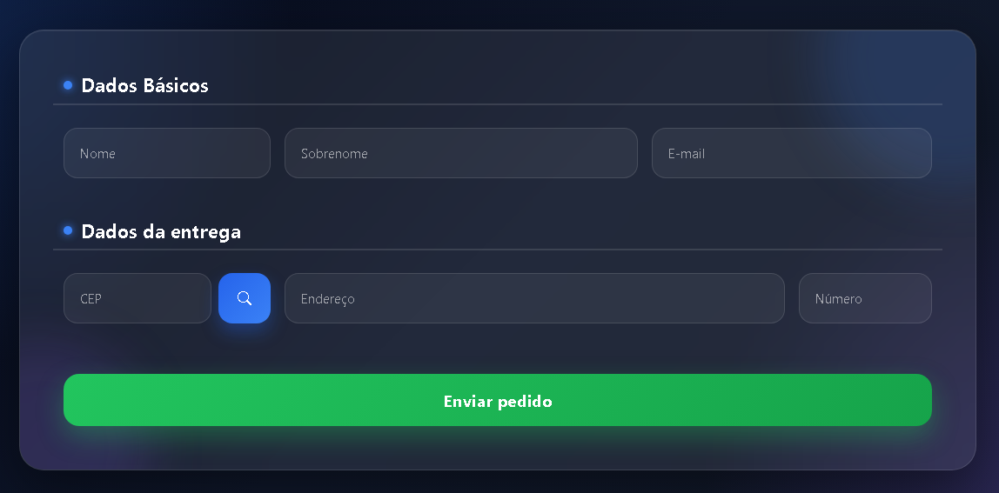

# 📦 Buscar Endereço com ViaCEP

Projeto desenvolvido para praticar conceitos de **AJAX**, **requisições assíncronas** e **consumo de APIs** utilizando a API pública do ViaCEP.

---

## 🚀 Tecnologias Utilizadas

* HTML5
* CSS3
* Bootstrap 5
* JavaScript
* jQuery
* AJAX
* API ViaCEP

---

## 🎯 Objetivo do Projeto

O objetivo deste projeto foi aprender na prática:

* Como consumir APIs externas
* Como utilizar AJAX
* Como fazer requisições assíncronas
* Manipulação do DOM com jQuery
* Preenchimento automático de formulários
* Tratamento de respostas da API

---

## 🔍 Funcionalidades

✅ Buscar endereço pelo CEP
✅ Preenchimento automático dos campos
✅ Interface moderna e responsiva
✅ Máscara para CEP
✅ Loading durante requisição
✅ Integração com a API ViaCEP

---

## 📸 Preview

```md

```

---

## 🌐 API Utilizada

### ViaCEP

API pública utilizada para buscar informações de endereço através do CEP.

🔗 https://viacep.com.br/

---

## 📚 O que aprendi

Durante o desenvolvimento deste projeto aprendi sobre:

* Requisições AJAX com jQuery
* Métodos HTTP
* JSON
* Manipulação assíncrona de dados
* Eventos JavaScript
* Integração frontend com APIs
* Organização de formulários responsivos

---

## ⚙️ Como executar o projeto

Clone o repositório:

```bash
git clone https://github.com/Synndm/buscar-endereco.git
```

Acesse a pasta:

```bash
cd buscar-endereco
```

Abra o arquivo:

```bash
frete.html
```

---

## 📁 Estrutura do Projeto

```bash
📦 buscar-endereco
 ┣ 📄 frete.html
 ┣ 📄 estilo.css
 ┣ 📄 main.js
 ┣ 📄 jquery.js
 ┣ 📄 jquery.mask.min.js
 ┗ 📄 README.md
```

---

## 👨‍💻 Autor

Desenvolvido por Josiel Silva.

🔗 GitHub:
https://github.com/Synndm

---

## ⭐ Projeto para estudos

Este projeto foi desenvolvido com foco em aprendizado e prática de frontend utilizando APIs e AJAX.
